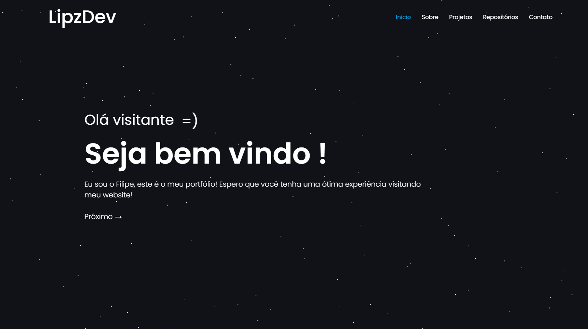

# 👨‍💻 Portfolio - Filipe Gomes

<div align="center">
  
  
  [](https://reactjs.org/)
  [](https://www.typescriptlang.org/)
  [](https://nodejs.org/)
  [](https://github.com/LipzDev)
</div>

---

## 🚀 Sobre Mim

Olá! Sou **Filipe Gomes**, um desenvolvedor Front-End apaixonado por criar experiências digitais excepcionais. Atualmente trabalho de forma remota (home office) e estou sempre conectado com as últimas tendências e tecnologias do mercado.

### 🎯 Especialização

- **Front-End**: React, TypeScript, Next.js, TailwindCSS
- **Back-End (estudando)**: Node.js, NestJS, TypeORM, PostgreSQL

### 🏠 Atuação

Trabalho de forma **remota (home office)**, sempre conectado com as últimas tendências e tecnologias do mercado.

### 🚀 Objetivos

Busco constantemente novos **desafios e oportunidades** para crescer profissionalmente e contribuir com projetos inovadores.

---

## 🛠️ Tecnologias Utilizadas

### Front-End

- **React 18.2.0** - Biblioteca JavaScript para interfaces
- **React Router DOM** - Roteamento para aplicações React
- **React Helmet** - Gerenciamento de meta tags
- **Axios** - Cliente HTTP para requisições
- **CSS3** - Estilização moderna e responsiva

### Desenvolvimento

- **Node.js** - Runtime JavaScript
- **Git** - Controle de versão
- **GitHub** - Plataforma de hospedagem

---

## 📱 Funcionalidades

### ✨ Interface Moderna

- Design responsivo e adaptável a todos os dispositivos
- Animações suaves e transições elegantes
- Tema escuro com gradientes modernos
- Navegação intuitiva e acessível

### 🎨 Seções Principais

- **Início**: Apresentação pessoal e profissional
- **Sobre**: Informações detalhadas sobre experiência e objetivos
- **Repositórios**: Projetos do GitHub com informações em tempo real
- **Contato**: Formulário de contato e links sociais

### 🔧 Recursos Técnicos

- **SEO Otimizado**: Meta tags e descrições para melhor indexação
- **Performance**: Carregamento rápido e otimizado
- **Responsividade**: Funciona perfeitamente em desktop, tablet e mobile
- **Acessibilidade**: Navegação por teclado e leitores de tela

---

## 🚀 Como Executar o Projeto

### Pré-requisitos

- Node.js (versão 14 ou superior)
- npm ou yarn

### Instalação

1. **Clone o repositório**

   ```bash
   git clone https://github.com/LipzDev/Portfolio-ReactJs.git
   cd Portfolio-ReactJs
   ```

2. **Instale as dependências**

   ```bash
   npm install
   # ou
   yarn install
   ```

3. **Execute o projeto**

   ```bash
   npm start
   # ou
   yarn start
   ```

4. **Acesse no navegador**
   ```
   http://localhost:3000
   ```

### Scripts Disponíveis

- `npm start` - Inicia o servidor de desenvolvimento
- `npm run build` - Cria a versão de produção
- `npm test` - Executa os testes
- `npm run eject` - Ejecta a configuração do Create React App

---

## 🌟 Destaques do Projeto

### 🎨 Design System

- Paleta de cores consistente com tema escuro
- Tipografia moderna e legível
- Componentes reutilizáveis e modulares
- Animações suaves e profissionais

### 📱 Responsividade

- **Desktop**: Layout otimizado para telas grandes
- **Tablet**: Adaptação para telas médias
- **Mobile**: Interface compacta e funcional
- **4K**: Suporte para resoluções ultra-altas

### ⚡ Performance

- Carregamento otimizado de imagens
- Lazy loading para componentes
- Código limpo e eficiente
- SEO otimizado

---

## 📞 Contato

<div align="center">
  <a href="https://github.com/LipzDev" target="_blank">
    
  </a>
  <a href="https://linkedin.com/in/lipzdev" target="_blank">
    
  </a>
  <a href="mailto:contato.devweb@hotmail.com.com">
    
  </a>
</div>

---

## 📄 Licença

Este projeto está sob a licença MIT. Veja o arquivo [LICENSE](LICENSE) para mais detalhes.

---

<div align="center">
  <p>Feito com ❤️ por <strong>Filipe Gomes</strong></p>
</div>
